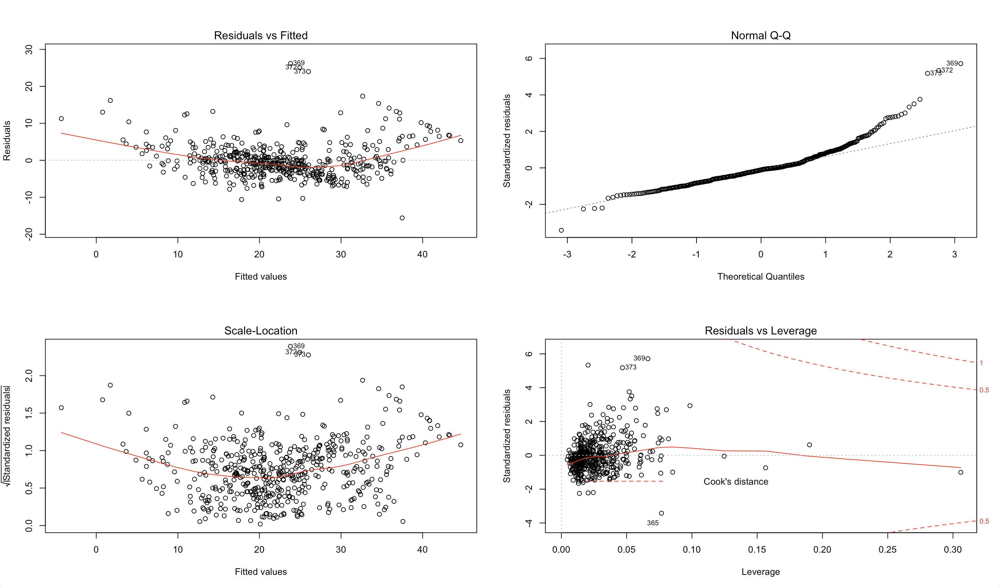
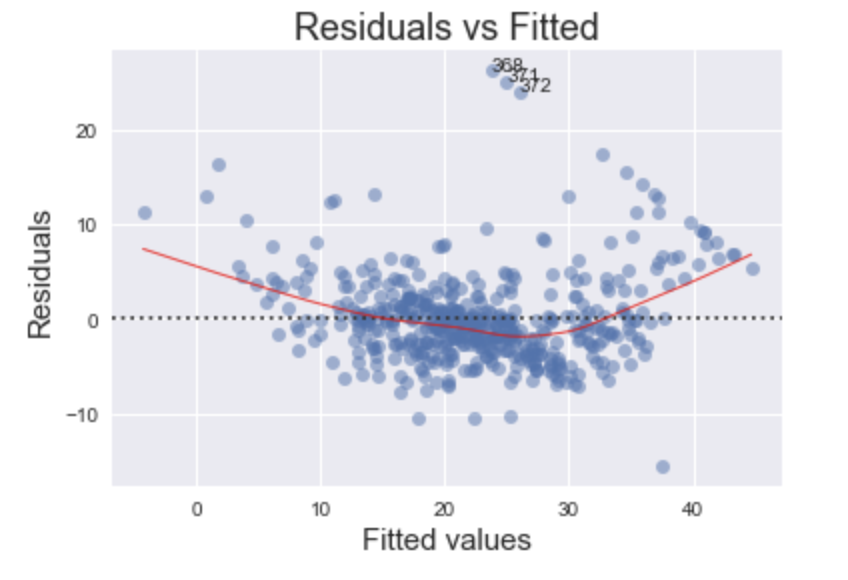
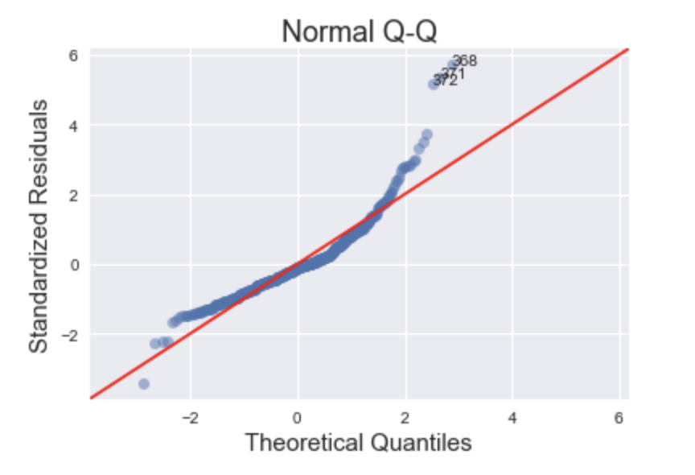
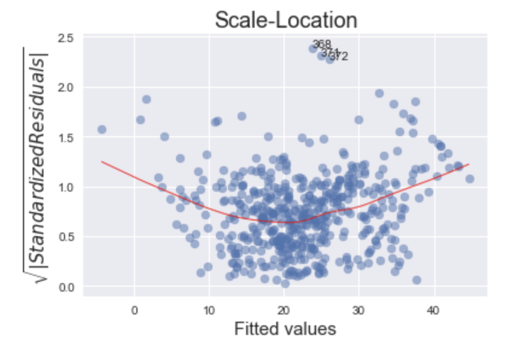
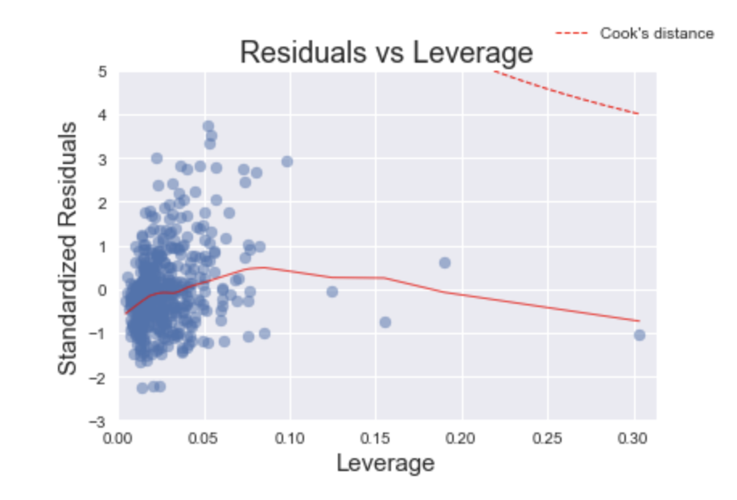

<!-- During my time working in market sizing and using general linear models, the group that I was in used R as the main programming language. This decision was made because of how the team was structured and the strengths of each member. R was primarily built as a data analysis tool with an emphasis on statistical features and is great for all sorts of statistical models. -->

Making the switch to Python after having used R for several years, I noticed there was a lack of good base plots for evaluating ordinary least squares (OLS) regression models in Python. From using R, I had familiarized myself with debugging and tweaking OLS models with the built-in diagnostic plots, but after switching to Python I didn't know how to get the original plots from R that I had turned to time and time again.

So, I did what most people in my situation would do - I turned to Google for help.

After trying different queries, I eventually found [this](https://medium.com/@emredjan/emulating-r-regression-plots-in-python-43741952c034) excellent resource that got me 90% of the way to recreating these plots in a programmatic way. This post will leverage a lot of that work and at the end will wrap it all in a function that anyone can cut and paste into their code to reproduce these plots regardless of the dataset.

# What are diagnostic plots?

In short, diagnostic plots help us determine visually how our model is fitting the data and if any of the basic assumptions of an OLS model are being violated. We will be looking at four main plots in this post and describe how each of them can be used to diagnose issues in an OLS model. Each of these plots will focus on the **residuals** - or errors - of a model, which is mathematical jargon for the difference between the actual value and the predicted value, i.e., $$ r_i = y_i - \bar{y}_i $$.

These 4 plots examine a few different assumptions about the model and the data:

1) The data can be fit a straight line (this includes any transformations made on the predictors, e.g., $$ x^2 $$)

2) Errors are normally distributed

3) Errors have constant variance, i.e., [homoscedasticity](https://en.wikipedia.org/wiki/Homoscedasticity)

4) There are no [high leverage points](https://newonlinecourses.science.psu.edu/stat501/node/337/)

Let's look at an example in R, and its corresponding output, using the *Boston* housing data.

```R
library(MASS)
model <- lm(medv ~ ., data=Boston)
par(mfrow=c(2,2))
plot(model)
```



Our goal is to recreate these R plots using Python and provide some insight into their meaning in the housing dataset.

We'll begin by importing the relevant libraries necessary for building our plots and reading in the data.

## Libraries

```python
import numpy as np
import pandas as pd
import seaborn as sns
import statsmodels.api as sm
import matplotlib.pyplot as plt
from statsmodels.graphics.gofplots import ProbPlot
plt.style.use('seaborn') # pretty matplotlib plots
plt.rc('font', size=14)
plt.rc('figure', titlesize=18)
plt.rc('axes', labelsize=15)
plt.rc('axes', titlesize=18)
```

## Data

```python
from sklearn.datasets import load_boston

boston = load_boston()

X = pd.DataFrame(boston.data, columns=boston.feature_names)
y = pd.DataFrame(boston.target)

# generate OLS model
model = sm.OLS(y, sm.add_constant(X))
model_fit = model.fit()

# create dataframe from X, y for easier plot handling
dataframe = pd.concat([X, y], axis=1)
```

# Residuals vs Fitted

First up is the **Residuals vs Fitted** plot. This graph shows if there are any nonlinear patterns in the residuals, and thus in the data as well. One of the mathematical assumptions in building an OLS model is that the data can be fit by a line. If this assumption holds and our data can be fit by a linear model, then we should see a relatively flat line when looking at the residuals vs fitted.  

An example of this failing would be trying to fit the function $$ f(x) = x^2 $$ with a linear regression $$ y = \beta_0 + \beta_1 x $$. Clearly, the relationship is nonlinear and thus the residuals will look bow-shaped.

## Code

```python
# model values
model_fitted_y = model_fit.fittedvalues
# model residuals
model_residuals = model_fit.resid
# normalized residuals
model_norm_residuals = model_fit.get_influence().resid_studentized_internal
# absolute squared normalized residuals
model_norm_residuals_abs_sqrt = np.sqrt(np.abs(model_norm_residuals))
# absolute residuals
model_abs_resid = np.abs(model_residuals)
# leverage, from statsmodels internals
model_leverage = model_fit.get_influence().hat_matrix_diag
# cook's distance, from statsmodels internals
model_cooks = model_fit.get_influence().cooks_distance[0]

plot_lm_1 = plt.figure()
plot_lm_1.axes[0] = sns.residplot(model_fitted_y, dataframe.columns[-1], data=dataframe,
                          lowess=True,
                          scatter_kws={'alpha': 0.5},
                          line_kws={'color': 'red', 'lw': 1, 'alpha': 0.8})

plot_lm_1.axes[0].set_title('Residuals vs Fitted')
plot_lm_1.axes[0].set_xlabel('Fitted values')
plot_lm_1.axes[0].set_ylabel('Residuals');
```

The code above yields the following plot



Notice the bow-shaped line in red. This is an indicator that we are not capturing some of the non-linear features of the model. In other words, we are _underfitting_ the model. Perhaps the variance in the data might be better captured using the _square_ (or some other non-linear transformation) of one or more of the features. Which feature(s) specifically is beyond the scope of this post.

# Normal Q-Q Plot

This plot shows if the residuals are normally distributed. A **good** normal QQ plot has all of the residuals lying on or close to the red line.

## Code
```python
QQ = ProbPlot(model_norm_residuals)
plot_lm_2 = QQ.qqplot(line='45', alpha=0.5, color='#4C72B0', lw=1)
plot_lm_2.axes[0].set_title('Normal Q-Q')
plot_lm_2.axes[0].set_xlabel('Theoretical Quantiles')
plot_lm_2.axes[0].set_ylabel('Standardized Residuals');
# annotations
abs_norm_resid = np.flip(np.argsort(np.abs(model_norm_residuals)), 0)
abs_norm_resid_top_3 = abs_norm_resid[:3]
for r, i in enumerate(abs_norm_resid_top_3):
    plot_lm_2.axes[0].annotate(i,
                               xy=(np.flip(QQ.theoretical_quantiles, 0)[r],
                                   model_norm_residuals[i]));
```



Looking at the graph above, there are several points that fall far away from the red line. This is indicative of the errors **not** being normally distributed, in fact our model suffers from "heavy tails".

What does this say about the data? We are more likely to see extreme values than expected if the data was truly normally distributed.

In general, there is plenty of wiggle room in violating these assumptions, but it is good to know what assumptions about the data we are violating.


# Scale-Location

This plot is a way to check if the residuals suffer from non-constant variance, aka [heteroscedasticity](https://en.wikipedia.org/wiki/Heteroscedasticity).

## Code

```python
plot_lm_3 = plt.figure()
  plt.scatter(model_fitted_y, model_norm_residuals_abs_sqrt, alpha=0.5);
  sns.regplot(model_fitted_y, model_norm_residuals_abs_sqrt,
              scatter=False,
              ci=False,
              lowess=True,
              line_kws={'color': 'red', 'lw': 1, 'alpha': 0.8});
  plot_lm_3.axes[0].set_title('Scale-Location')
  plot_lm_3.axes[0].set_xlabel('Fitted values')
  plot_lm_3.axes[0].set_ylabel('$\sqrt{|Standardized Residuals|}$');

  # annotations
  abs_sq_norm_resid = np.flip(np.argsort(model_norm_residuals_abs_sqrt), 0)
  abs_sq_norm_resid_top_3 = abs_sq_norm_resid[:3]
  for i in abs_norm_resid_top_3:
      plot_lm_3.axes[0].annotate(i,
                                 xy=(model_fitted_y[i],
                                     model_norm_residuals_abs_sqrt[i]));

```



*This* particular plot (with the housing data) is a tricky one to debug. The more horizontal the red line is, the more likely the data is homoscedastic. While a typical heteroscedastic plot has a sideways "V" shape, our graph has higher values on the left and on the right versus in the middle. This might be caused by not capturing the non-linearities in the model (see Residuals vs Fitted plot) and merits further investigation or model tweaking. The two most common methods of "fixing" heteroscedasticity is using a weighted least squares approach, or using a heteroscedastic corrected covariance matrix (hccm). Both of these methods are beyond the scope of this post.

# Residuals vs Leverage

Leverage points are nasty buggers. Unlike outliers, which have a high $$ y $$ value, leverage points have extreme $$ x $$ values. This may not seem so bad at face value, but it can have damaging effects on the model because the $$ \beta $$ coefficients can be very sensitive to leverage points. The purpose of the Residuals vs Leverage plot is to identify these problematic observations.

## Code
```python
plot_lm_4 = plt.figure();
  plt.scatter(model_leverage, model_norm_residuals, alpha=0.5);
  sns.regplot(model_leverage, model_norm_residuals,
              scatter=False,
              ci=False,
              lowess=True,
              line_kws={'color': 'red', 'lw': 1, 'alpha': 0.8});
  plot_lm_4.axes[0].set_xlim(0, max(model_leverage)+0.01)
  plot_lm_4.axes[0].set_ylim(-3, 5)
  plot_lm_4.axes[0].set_title('Residuals vs Leverage')
  plot_lm_4.axes[0].set_xlabel('Leverage')
  plot_lm_4.axes[0].set_ylabel('Standardized Residuals');

  # annotations
  leverage_top_3 = np.flip(np.argsort(model_cooks), 0)[:3]
  for i in leverage_top_3:
      plot_lm_4.axes[0].annotate(i,
                                 xy=(model_leverage[i],
                                     model_norm_residuals[i]));
```



Fortunately, this arguably one of the easiest plots to interpret. Thanks to [Cook's Distance](https://en.wikipedia.org/wiki/Cook%27s_distance), we only need to find leverage points that have a distance greater than 0.5. In this plot, we do not have any leverage points.

In practice, there may be cases where we may want to remove points with a Cook's distance of less than 0.5, especially if there are only a few observations compared to the rest of the data. I would argue that removing the point on the far right of the plot should improve the model. If the point is removed, we we would re-run this analysis again and determine how much the model improved.

# Conclusion

In this post I set out to reproduce, using Python, the diagnostic plots found in the R programming language. Furthermore, I showed various ways to interpret them using a sample dataset.

Lastly, there will be readers who after seeing this post will want to reproduce these plots in a systematic way. This was something I had initially set out to do myself but did not find much success. Below, I provide the code for the function to reproduce the plots in Python.

# Wrapping it all in a function


def graph(formula, x_range, label=None):
    """
    Helper function for plotting cook's distance lines
    """
    x = x_range
    y = formula(x)
    plt.plot(x, y, label=label, lw=1, ls='--', color='red')


def diagnostic_plots(X, y, model_fit=None):
  """
  Function to reproduce the 4 base plots of an OLS model in R.

  ---
  Inputs:

  X: A numpy array or pandas dataframe of the features to use in building the linear regression model

  y: A numpy array or pandas series/dataframe of the target variable of the linear regression model

  model_fit [optional]: a statsmodel.api.OLS model after regressing y on X. If not provided, will be
                        generated from X, y
  """

  if not model_fit:
      model_fit = sm.OLS(y, sm.add_constant(X)).fit()

  # create dataframe from X, y for easier plot handling
  dataframe = pd.concat([X, y], axis=1)

  # model values
  model_fitted_y = model_fit.fittedvalues
  # model residuals
  model_residuals = model_fit.resid
  # normalized residuals
  model_norm_residuals = model_fit.get_influence().resid_studentized_internal
  # absolute squared normalized residuals
  model_norm_residuals_abs_sqrt = np.sqrt(np.abs(model_norm_residuals))
  # absolute residuals
  model_abs_resid = np.abs(model_residuals)
  # leverage, from statsmodels internals
  model_leverage = model_fit.get_influence().hat_matrix_diag
  # cook's distance, from statsmodels internals
  model_cooks = model_fit.get_influence().cooks_distance[0]

  plot_lm_1 = plt.figure()
  plot_lm_1.axes[0] = sns.residplot(model_fitted_y, dataframe.columns[-1], data=dataframe,
                            lowess=True,
                            scatter_kws={'alpha': 0.5},
                            line_kws={'color': 'red', 'lw': 1, 'alpha': 0.8})

  plot_lm_1.axes[0].set_title('Residuals vs Fitted')
  plot_lm_1.axes[0].set_xlabel('Fitted values')
  plot_lm_1.axes[0].set_ylabel('Residuals');

  # annotations
  abs_resid = model_abs_resid.sort_values(ascending=False)
  abs_resid_top_3 = abs_resid[:3]
  for i in abs_resid_top_3.index:
      plot_lm_1.axes[0].annotate(i,
                                 xy=(model_fitted_y[i],
                                     model_residuals[i]));

  QQ = ProbPlot(model_norm_residuals)
  plot_lm_2 = QQ.qqplot(line='45', alpha=0.5, color='#4C72B0', lw=1)
  plot_lm_2.axes[0].set_title('Normal Q-Q')
  plot_lm_2.axes[0].set_xlabel('Theoretical Quantiles')
  plot_lm_2.axes[0].set_ylabel('Standardized Residuals');
  # annotations
  abs_norm_resid = np.flip(np.argsort(np.abs(model_norm_residuals)), 0)
  abs_norm_resid_top_3 = abs_norm_resid[:3]
  for r, i in enumerate(abs_norm_resid_top_3):
      plot_lm_2.axes[0].annotate(i,
                                 xy=(np.flip(QQ.theoretical_quantiles, 0)[r],
                                     model_norm_residuals[i]));

  plot_lm_3 = plt.figure()
  plt.scatter(model_fitted_y, model_norm_residuals_abs_sqrt, alpha=0.5);
  sns.regplot(model_fitted_y, model_norm_residuals_abs_sqrt,
              scatter=False,
              ci=False,
              lowess=True,
              line_kws={'color': 'red', 'lw': 1, 'alpha': 0.8});
  plot_lm_3.axes[0].set_title('Scale-Location')
  plot_lm_3.axes[0].set_xlabel('Fitted values')
  plot_lm_3.axes[0].set_ylabel('$\sqrt{|Standardized Residuals|}$');

  # annotations
  abs_sq_norm_resid = np.flip(np.argsort(model_norm_residuals_abs_sqrt), 0)
  abs_sq_norm_resid_top_3 = abs_sq_norm_resid[:3]
  for i in abs_norm_resid_top_3:
      plot_lm_3.axes[0].annotate(i,
                                 xy=(model_fitted_y[i],
                                     model_norm_residuals_abs_sqrt[i]));


  plot_lm_4 = plt.figure();
  plt.scatter(model_leverage, model_norm_residuals, alpha=0.5);
  sns.regplot(model_leverage, model_norm_residuals,
              scatter=False,
              ci=False,
              lowess=True,
              line_kws={'color': 'red', 'lw': 1, 'alpha': 0.8});
  plot_lm_4.axes[0].set_xlim(0, max(model_leverage)+0.01)
  plot_lm_4.axes[0].set_ylim(-3, 5)
  plot_lm_4.axes[0].set_title('Residuals vs Leverage')
  plot_lm_4.axes[0].set_xlabel('Leverage')
  plot_lm_4.axes[0].set_ylabel('Standardized Residuals');

  # annotations
  leverage_top_3 = np.flip(np.argsort(model_cooks), 0)[:3]
  for i in leverage_top_3:
      plot_lm_4.axes[0].annotate(i,
                                 xy=(model_leverage[i],
                                     model_norm_residuals[i]));

  p = len(model_fit.params) # number of model parameters
  graph(lambda x: np.sqrt((0.5 * p * (1 - x)) / x),
        np.linspace(0.001, max(model_leverage), 50),
        'Cook\'s distance') # 0.5 line
  graph(lambda x: np.sqrt((1 * p * (1 - x)) / x),
        np.linspace(0.001, max(model_leverage), 50)) # 1 line
  plot_lm_4.legend(loc='upper right');

